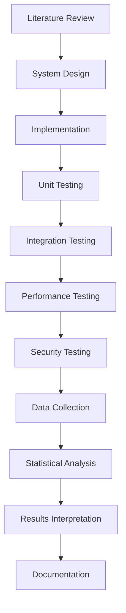

# BAB III METODE PENELITIAN

## 3.1 Jenis dan Pendekatan Penelitian

### 3.1.1 Jenis Penelitian
Penelitian ini menggunakan **metode penelitian kuantitatif** dengan pendekatan **Research and Development (R&D)** yang bersifat eksperimental. Metode kuantitatif dipilih karena penelitian ini berfokus pada pengukuran dan analisis numerik terhadap performa, efektivitas, dan keamanan sistem yang diimplementasikan.

### 3.1.2 Justifikasi Pemilihan Metode Kuantitatif

#### A. **Pengukuran Performa Sistem**
Metode kuantitatif memungkinkan pengukuran objektif terhadap metrics performa sistem seperti:
- **Response Time**: Pengukuran waktu respons dalam milidetik untuk setiap operasi enkripsi/dekripsi
- **Throughput**: Jumlah transaksi yang dapat diproses per detik (TPS - Transactions Per Second)
- **Resource Utilization**: Penggunaan CPU, memory, dan storage dalam bentuk persentase
- **Latency**: Waktu delay dalam komunikasi antar komponen sistem

```typescript
// Contoh pengukuran kuantitatif dalam implementasi
const performanceMetrics = {
    encryptionTime: measureTime(() => encryptData(paymentData, privateKey)),
    decryptionTime: measureTime(() => decryptData(encryptedData, privateKey)),
    keyGenerationTime: measureTime(() => generateUserPrivateKey(userId, email)),
    totalProcessingTime: measureTime(() => processPayment(paymentRequest))
};
```

#### B. **Analisis Efektivitas Keamanan**
Pendekatan kuantitatif memungkinkan evaluasi objektif terhadap tingkat keamanan sistem melalui:
- **Security Metrics**: Jumlah successful/failed encryption attempts
- **Key Uniqueness Analysis**: Statistik distribusi kunci yang dihasilkan
- **Encryption Strength**: Analisis entropy dan randomness distribusi
- **Vulnerability Assessment**: Scoring quantitative terhadap potential vulnerabilities

#### C. **Validasi Eksperimental**
Metode kuantitatif mendukung validasi hipotesis melalui:
- **Controlled Experiments**: Testing dengan variabel yang terkontrol
- **Statistical Analysis**: Analisis statistik terhadap hasil pengujian
- **Comparative Studies**: Perbandingan numerik dengan baseline systems
- **Reproducible Results**: Hasil yang dapat direproduksi dan diverifikasi

### 3.1.3 Alasan Tidak Menggunakan Metode Kualitatif

#### A. **Fokus pada Technical Implementation**
Penelitian ini berfokus pada aspek teknis implementasi sistem keamanan yang memerlukan pengukuran objektif dan terukur, bukan pada persepsi atau pengalaman subjektif pengguna.

#### B. **Measurement-Oriented Research**
Tujuan penelitian adalah mengukur efektivitas dan performa sistem secara objektif, yang lebih sesuai dengan pendekatan kuantitatif yang berbasis data numerik.

#### C. **Reproducibility Requirement**
Hasil penelitian harus dapat direproduksi dan diverifikasi oleh peneliti lain, yang memerlukan metode pengukuran yang objektif dan standardized.

## 3.2 Desain Penelitian

### 3.2.1 Model Penelitian Eksperimental
Penelitian ini menggunakan **Pre-Experimental Design** dengan model **One-Group Pretest-Posttest Design**:

```
Baseline System → Implementation → Testing → Evaluation
     (O₁)           (X)           (O₂)        (Analysis)
```

Dimana:
- **O₁**: Pengukuran baseline system (payment gateway tanpa enkripsi individual)
- **X**: Treatment/Implementation (sistem enkripsi end-to-end dengan kunci individual)
- **O₂**: Pengukuran post-implementation (sistem dengan enkripsi individual)

### 3.2.2 Variabel Penelitian

#### A. **Variabel Independen (X)**
- Implementasi algoritma AES-256 dengan kunci individual
- Sistem key generation berdasarkan User ID + Email
- Mekanisme enkripsi end-to-end

#### B. **Variabel Dependen (Y)**
- **Performance Metrics**:
  - Response time (ms)
  - Throughput (TPS)
  - Resource utilization (%)
  - Memory usage (MB)

- **Security Metrics**:
  - Encryption success rate (%)
  - Key uniqueness index
  - Data integrity verification rate (%)
  - Error rate dalam dekripsi (%)

#### C. **Variabel Kontrol**
- Hardware specifications (consistent testing environment)
- Software versions (Node.js, dependencies)
- Network conditions (localhost testing)
- Data volume (standardized test datasets)

### 3.2.3 Hipotesis Penelitian

#### H₁: Hipotesis Performa
**H₁**: Implementasi enkripsi end-to-end dengan kunci individual tidak memberikan degradasi performa yang signifikan (< 20% increase dalam response time) dibandingkan dengan sistem baseline.

**H₀**: Implementasi enkripsi end-to-end dengan kunci individual memberikan degradasi performa yang signifikan (≥ 20% increase dalam response time).

#### H₂: Hipotesis Keamanan
**H₁**: Sistem enkripsi individual memberikan tingkat keamanan yang superior dengan success rate ≥ 99.5% dalam proses enkripsi/dekripsi dan key uniqueness index ≥ 0.99.

**H₀**: Sistem enkripsi individual tidak memberikan tingkat keamanan yang superior dengan success rate < 99.5% atau key uniqueness index < 0.99.

## 3.3 Populasi dan Sampel

### 3.3.1 Populasi
Populasi dalam penelitian ini adalah **seluruh transaksi pembayaran digital** yang diproses melalui sistem payment gateway dengan karakteristik:
- Transaksi dengan data pembayaran sensitif (nomor kartu, CVV, personal information)
- Transaksi yang memerlukan high-security protection
- Transaksi dalam environment e-commerce atau fintech

### 3.3.2 Sampel
Sampel penelitian berupa **simulated payment transactions** dengan karakteristik:

#### A. **Transaction Samples**
- **Sample Size**: 10,000 simulated transactions
- **User Profiles**: 1,000 unique users
- **Transaction Types**: Payment, refund, authorization
- **Data Variability**: Berbagai ukuran payload (1KB - 10KB)

#### B. **Performance Testing Samples**
- **Concurrent Users**: 10, 50, 100, 500, 1000 concurrent users
- **Duration**: 30 minutes per test scenario
- **Iterations**: 5 iterations per scenario untuk statistical significance

#### C. **Security Testing Samples**
- **Encryption Tests**: 50,000 encrypt/decrypt operations
- **Key Generation Tests**: 10,000 unique key generations
- **Stress Tests**: 100,000 rapid-fire requests

### 3.3.3 Teknik Sampling
Menggunakan **Systematic Sampling** untuk memastikan representativeness:
- Random selection dari transaction patterns
- Proportional distribution across user types
- Time-based sampling untuk peak/off-peak scenarios

## 3.4 Instrumen Penelitian

### 3.4.1 Tools dan Software

#### A. **Development Tools**
```json
{
  "runtime": "Node.js v18+",
  "language": "TypeScript 5.0+",
  "framework": "Express.js 4.18+",
  "database": "SQLite 3.x",
  "encryption": "crypto-js 4.2+",
  "testing": "Jest 29.x"
}
```

#### B. **Performance Testing Tools**
- **Artillery.js**: Load testing dan performance benchmarking
- **Clinic.js**: Node.js performance profiling
- **Node.js Built-in Profiler**: Memory dan CPU monitoring

#### C. **Security Testing Tools**
- **Custom Security Test Suite**: Encryption/decryption validation
- **Crypto Analysis Tools**: Key distribution analysis
- **Penetration Testing Scripts**: Simulated attack scenarios

### 3.4.2 Metrics dan Measurement

#### A. **Performance Metrics**
```typescript
interface PerformanceMetrics {
  responseTime: {
    mean: number;        // Average response time (ms)
    median: number;      // Median response time (ms)
    p95: number;         // 95th percentile (ms)
    p99: number;         // 99th percentile (ms)
  };
  throughput: {
    tps: number;         // Transactions per second
    rps: number;         // Requests per second
  };
  resources: {
    cpuUsage: number;    // CPU utilization (%)
    memoryUsage: number; // Memory usage (MB)
    diskIO: number;      // Disk I/O operations
  };
}
```

#### B. **Security Metrics**
```typescript
interface SecurityMetrics {
  encryption: {
    successRate: number;     // Successful encryptions (%)
    errorRate: number;       // Failed encryptions (%)
    integrityCheck: number;  // Data integrity verification (%)
  };
  keyGeneration: {
    uniquenessIndex: number; // Key uniqueness coefficient
    distributionEntropy: number; // Entropy of key distribution
    collisionRate: number;   // Key collision rate (%)
  };
  systemSecurity: {
    vulnerabilityScore: number; // Security assessment score
    attackResistance: number;   // Resistance to common attacks (%)
  };
}
```

## 3.5 Teknik Pengumpulan Data

### 3.5.1 Data Collection Methods

#### A. **Automated Logging**
```typescript
// Implementasi logging otomatis untuk data collection
class MetricsCollector {
  collectPerformanceData(operation: string, startTime: number, endTime: number) {
    const metrics = {
      operation,
      responseTime: endTime - startTime,
      timestamp: Date.now(),
      memoryUsage: process.memoryUsage(),
      cpuUsage: process.cpuUsage()
    };
    this.saveMetrics(metrics);
  }
}
```

#### B. **Structured Testing Protocols**
1. **Baseline Testing**: Pengukuran sistem tanpa enkripsi individual
2. **Implementation Testing**: Pengukuran sistem dengan enkripsi individual
3. **Stress Testing**: Pengukuran pada kondisi high-load
4. **Security Testing**: Pengukuran resistensi terhadap attacks

### 3.5.2 Data Types

#### A. **Primary Data**
- Performance measurements dari sistem yang diimplementasikan
- Security test results dari pengujian keamanan
- System logs dan monitoring data
- Error rates dan failure statistics

#### B. **Secondary Data**
- Literature review data tentang AES algorithm performance
- Industry benchmarks untuk payment gateway systems
- Security standards dan best practices documentation

## 3.6 Teknik Analisis Data

### 3.6.1 Statistical Analysis

#### A. **Descriptive Statistics**
- Mean, median, mode untuk performance metrics
- Standard deviation dan variance analysis
- Percentile analysis (P95, P99) untuk response time distribution
- Frequency distribution untuk error rates

#### B. **Inferential Statistics**
- **T-test**: Perbandingan means antara baseline dan implementation
- **Chi-square test**: Analisis distribusi categorical data
- **Correlation analysis**: Hubungan antara variables
- **Regression analysis**: Predictive modeling untuk performance

### 3.6.2 Data Analysis Tools

#### A. **Quantitative Analysis**
```python
# Contoh analysis menggunakan Python untuk statistical processing
import pandas as pd
import numpy as np
from scipy import stats

def analyze_performance_data(baseline_data, implementation_data):
    # Descriptive statistics
    baseline_stats = baseline_data.describe()
    implementation_stats = implementation_data.describe()
    
    # T-test untuk perbandingan means
    t_stat, p_value = stats.ttest_ind(baseline_data, implementation_data)
    
    # Effect size calculation
    effect_size = (implementation_data.mean() - baseline_data.mean()) / baseline_data.std()
    
    return {
        'baseline_stats': baseline_stats,
        'implementation_stats': implementation_stats,
        't_statistic': t_stat,
        'p_value': p_value,
        'effect_size': effect_size
    }
```

#### B. **Visualization Tools**
- **Charts**: Performance comparison charts
- **Graphs**: Response time distribution graphs
- **Heatmaps**: Resource utilization heatmaps
- **Dashboards**: Real-time monitoring dashboards

### 3.6.3 Validation Criteria

#### A. **Performance Acceptance Criteria**
- Response time increase < 20% compared to baseline
- Throughput decrease < 15% compared to baseline
- Memory usage increase < 30% compared to baseline
- Error rate < 0.1% for all operations

#### B. **Security Acceptance Criteria**
- Encryption success rate ≥ 99.5%
- Key uniqueness index ≥ 0.99
- Zero key collisions in test scenarios
- Data integrity verification rate = 100%

## 3.7 Tahapan Penelitian

### 3.7.1 Timeline Penelitian

| Phase | Duration | Activities | Deliverables |
|-------|----------|------------|-------------|
| **Phase 1: Analysis** | Month 1-2 | Literature review, requirement analysis | Requirements document |
| **Phase 2: Design** | Month 3-4 | System architecture, algorithm design | Design specifications |
| **Phase 3: Implementation** | Month 5-7 | Coding, unit testing, integration | Working system |
| **Phase 4: Testing** | Month 8-9 | Performance testing, security testing | Test results |
| **Phase 5: Analysis** | Month 10-11 | Data analysis, statistical evaluation | Analysis report |
| **Phase 6: Documentation** | Month 12 | Final documentation, thesis writing | Final thesis |

### 3.7.2 Research Workflow



### 3.7.3 Quality Assurance

#### A. **Code Quality**
- Code review processes
- Automated testing (unit, integration)
- Static code analysis
- Security code scanning

#### B. **Research Quality**
- Peer review of methodology
- Reproducible experiments
- Documented procedures
- Version control for all artifacts

---

*Metodologi penelitian ini dirancang untuk memberikan hasil yang objektif, terukur, dan dapat diverifikasi dalam mengevaluasi efektivitas implementasi keamanan end-to-end dengan algoritma AES dan kunci pribadi berdasarkan identifier unik pengguna pada sistem payment gateway.*
